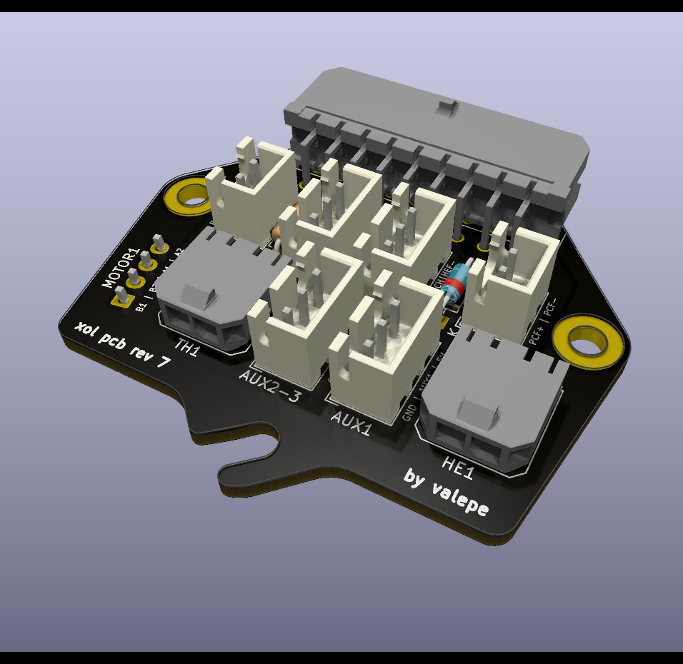
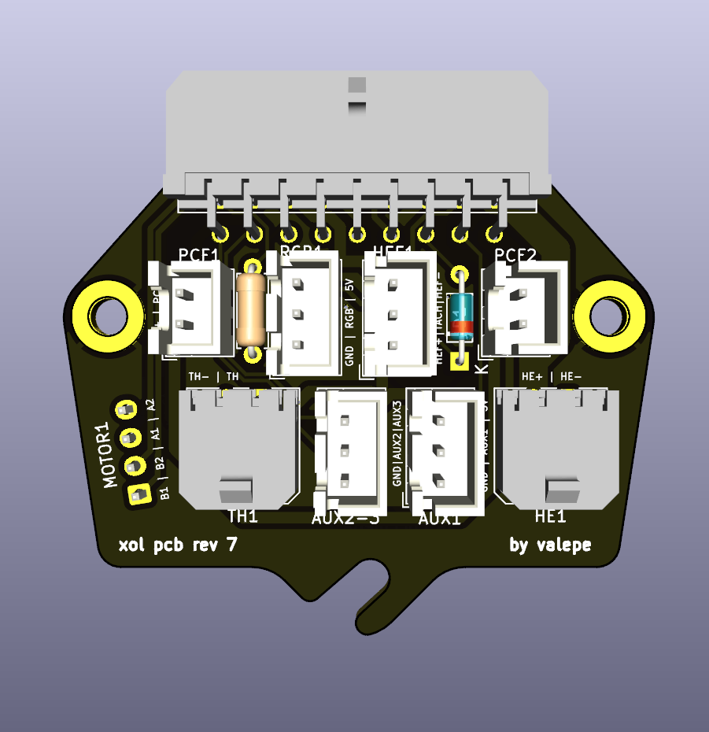
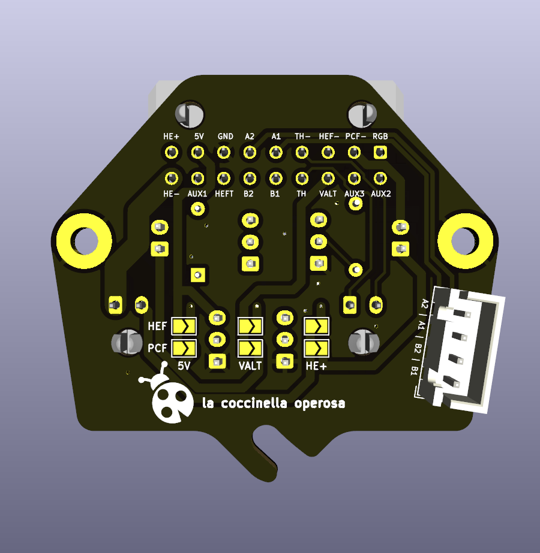
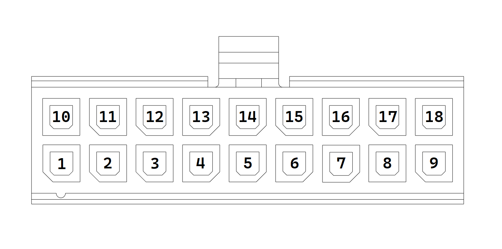

# Xol PCB

This is a PCB made for Armchair Engineering's [Xol Toolhead](https://github.com/Armchair-Engineering/Xol-Toolhead), featuring:
* One hotend cooling fan JST-XH connectors with diode for tach signal
* Two part cooling  fan JST-XH connectors
* One heater Micro-Fit connector
* One thermistor Micro-Fit connector
* One Neopixel JST-XH connector with resistor for the data line
* Two auxiliary JST-XH connectors
* One extruder motor connector
* Selectable fan voltage (5V, Alt, 24V)
* Integrated mount for carriage screw

I customized the Xol Toolhead board by [ruiqimao](https://github.com/ruiqimao/VoronStuff/tree/main/Xol_PCB) to suite my needs:
* A three pins connector for the hotend fan with tach signal and its diode
* A resistor for the RGB data line to avoid signal noise for the cable length
* Three AUX pins for X-endstop and the two filament sensors

**ATTENTION!** This pcb isn't pin compatible with ruiqimao one starting from the main connector (from 16 to 18 pins). Even the thermistor and hotend connectors are swapped. Check carefully the pinout!

## BOM

In addition to the PCB, the following things are needed:

| Part | Quantity | Link |
|:-:|:-:|:-:|
| Molex Micro-Fit 3.0 430451800 | 1 | [DigiKey](https://www.digikey.com/en/products/detail/molex/0430451800/531425) |
| Molex Micro-Fit 3.0 430650200 | 2 | [DigiKey](https://www.digikey.com/en/products/detail/molex/0436500200/268989) |
| JST B2B-XH-A | 2 | [DigiKey](https://www.digikey.com/en/products/detail/jst-sales-america-inc./B2B-XH-A(LF)(SN)/1651045) |
| JST B3B-XH-A | 4 | [DigiKey](https://www.digikey.com/en/products/detail/jst-sales-america-inc./B3B-XH-A/1651046) |
| JST B4B-XH-A | 1 | [DigiKey](https://www.digikey.com/en/products/detail/jst-sales-america-inc./B4B-XH-A(LF)(SN)/1651047) |
| BAT85 diode | 1 | [DigiKey](https://www.digikey.com/en/products/detail/nexperia-usa-inc/BAT85-133/1232135) |
| 470 Ohm resistor | 1 | [DigiKey](https://www.digikey.com/en/products/detail/stackpole-electronics-inc/CF14JT470R/1741440) |

## Pinout

From the point of view looking directly at the **wiring harness connector**:

| Pin | Usage | Pin | Usage |
|:-:|:-:|:-:|:-:|
| 1 | Neopixel | 10 | Auxiliary 2 |
| 2 | Part cooling fan ground | 11 | Auxiliary 3 |
| 3 | Hotend fan ground | 12 | Alt voltage |
| 4 | Thermistor ground | 13 | Thermistor |
| 5 | Motor A1 | 14 | Motor B1 |
| 6 | Motor A2 | 15 | Motor B2 |
| 7 | Ground | 16 | Hotend fan tach |
| 8 | 5V | 17 | Auxiliary 1 |
| 9 | Hotend voltage | 18 | Hotend ground |

## Selectable fan voltage

There are two sets of solder jumpers, one for each type of fan, that should be bridged to select the fan voltage.

## Extruder compatibility
The PCB and strain relief are designed with only the [Sherpa Mini](https://github.com/Annex-Engineering/Sherpa_Mini-Extruder) in mind. **Usage with other extruders may require the motor connector to be swapped to the back side.**

## Credits

Credits to the great work of XOL Toolhead board by [ruiqimao](https://github.com/ruiqimao/VoronStuff/tree/main/Xol_PCB).
